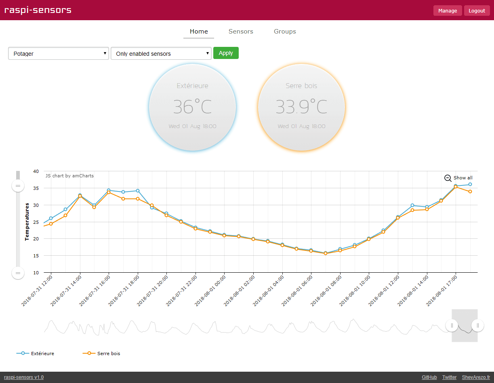
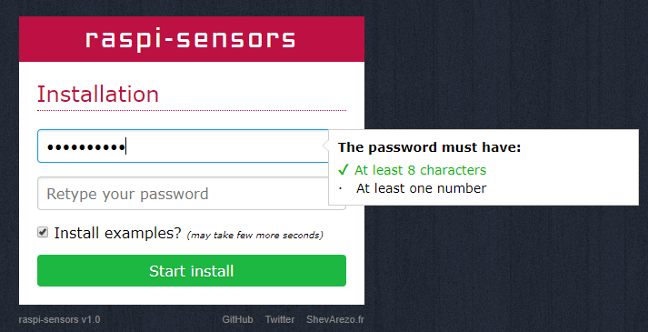
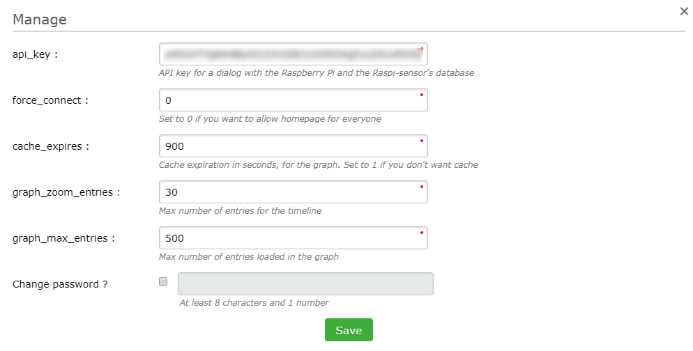
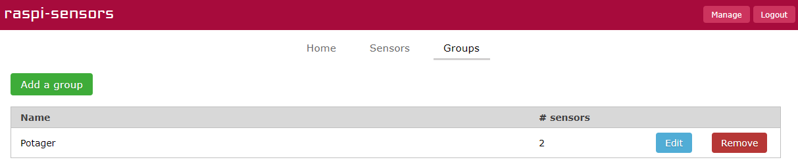
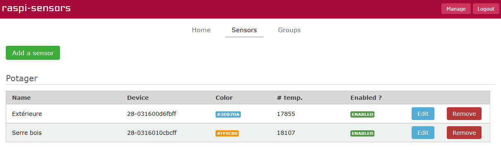
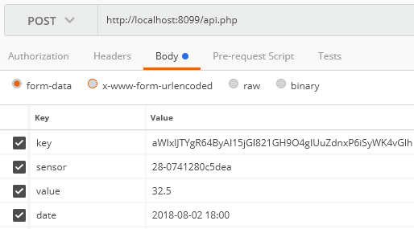

# raspi-sensors

This project is basically a personal project. I have a Raspberry Pi 2 on which I have 2 temperatures sensors Dallas DS18b20. They allow to recover the temperature of the air and inside my greenhouse of garden.

The temperatures are transmitted by the Raspberry Pi via a Python script using the **raspi-sensors** API. An API key is used to secure the transfer of information.

**An example of the Python script is available in `docs` folder.**

This Web application allows to consult the current temperature as well as the temperature history of each sensor.

## Installation

Prerequisites:

- PHP 5.3 minimum
- SQLite

Clone this repository or download it.

Drop the files to your server via FTP or other and go to the site.

The installation form should appear.

Fill in a complex password and choose to install the examples or not. Checking the box creates a group of sensors, as well as three sensors devices. One hundred temperatures will then be inserted by sensor.
You can of course delete all this data later.

## Configuration

The installation script creates a SQLite database in the "datas" folder. The file name is generated randomly to ensure its security.

The path to this SQLite file is inserted in the `datas/config.json` file, in the` db` section.

Also, the administrator password is encrypted in sha256 and is inserted in `datas/config.json` in the` passwd` section.

The parameters of **raspi-sensors** can be modified directly in the application. Once logged in, click on the "Manage" button at the top right. A window opens with several fields:

| Parameter  | Description  | Default value  |
|------------|--------------|--------------------|
| api_key | API key for a dialog with the Raspberry Pi and the Raspi-sensor's database | - |
| force_connect | If 0, access will be public. Otherwise, the administrator password will be required to access the temperatures | 0 |
| cache_expires | Cache expiration in seconds, for the graph. Set to 1 if you don't want cache | 900 |
| graph_zoom_entries | Max number of entries for the timeline | 30 |
| graph_max_entries | Max number of entries loaded in the graph (total) | 500 |

# Usage

Start by creating a sensor group.

Then add your sensor device.

The *device* is the sensor ID number (see the `/sys/bus/w1/devices/` folder).

Run a query to the API (see next chapter) or use the Python script in the `docs` folder. Modify the API key found in the settings (*Manage* button) and the access URL to your raspi-sensors.

Add a scheduled task (cron):

	0 * * * * /path/to/sendSensorsTemperatures.py

The temperatures of your sensors will be sent every hour to your raspi-sensors.

## Usage of API

The **raspi-sensors** API allows you to send the values of the sensors connected to your Raspberry Pi for insertion into the database.

Endpoint : /api.php

POST parameters:

| Parameter  | Description  |
|------------|--------------|
| key | API key of raspi-sensors |
| sensor | Sensor identification number |
| value | Value of the sensor (temperature) |
| date | Date of temperature reading |

